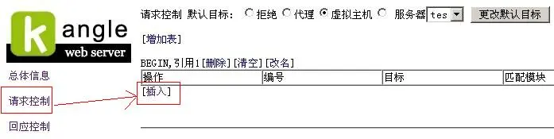
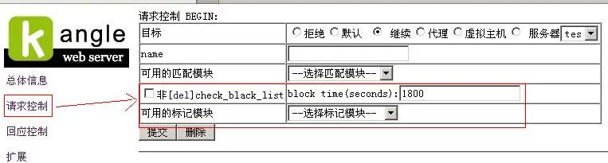
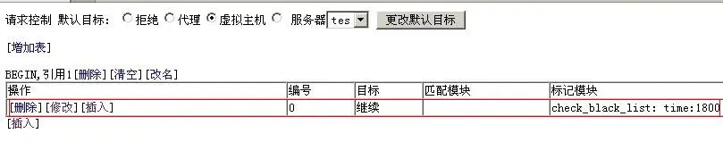
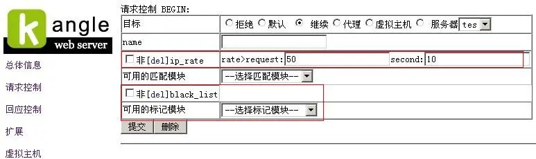
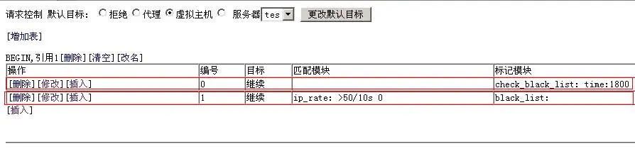
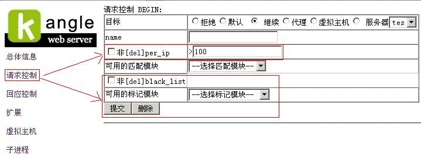
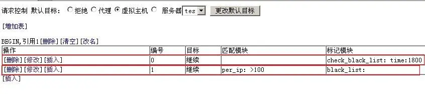
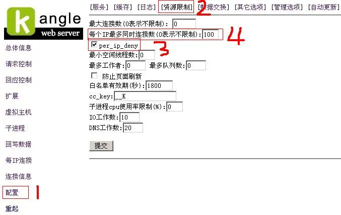
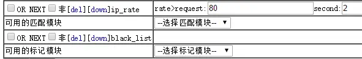

本教程需要配合kangle商业版才可以使用，且kangle版本为3.1以上。

用kangle访问控制设置插入黑名单需要用到kangle请求控制里-->标记模块:
check_black_list   说明：检查黑名单
black_list  说明：插入到黑名单

(注意：check_black_list一般加在 black_list 前面，先检查该访问地址是否已被插入到黑名单)

和插入黑名单可配合使用的模块主要有：
第一:   ip_rate   说明:ip访问频率
第二： per_ip  说明：匹配每ip连接数
第三： 限制每个IP最多同时连接数    (在kangle配置-->>资源限制-->说明：匹配每ip连接数 )

第一,现在我们来讲下ip_rate的设置方法：

1. 先进入kangle的3311管理后台,点左边的请求控制，再点插入，如图：

2. 选择请求控制--》标记模块里的check_black_list,检查是访问是否已被加入黑名单，这个模块一般加在black_list前面
下图1800是表示对符合插入黑名单的时间,单位是(秒)

然后点提交

3. 然后再点插入，访问的频率根据自身情况设置，如下图举例是10秒内50次访问 ：

然后点提交

这样ip_rate的设置就完成了

第二,现在我们来讲下per_ip的设置方法：

先按第一个教程的1，2步操作好先插入check_black_list
然后如下图设置，per_ip是匹配每ip连接，根据自身情况输入,如下图举例是匹配每IP 100连接数，目标设置拒绝

提交后还有一个地方要设置，要勾选per_ip_deny,启用per_ip
同时可以配合设置每个IP最多同时连接数，根据自身情况设置，本例所举是超过100连接数加入黑名单

至此，如何在kangle访问控制内设置黑名单介绍完毕

效果图，个人建议使用频率，2秒80次封禁10分钟是不错的设置。目标设置拒绝

补充，现在http2的话，资源并发占用很大，建议调大数值，比如说10秒内200次。