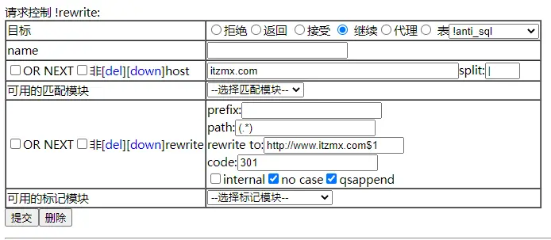

kangle用简易版的rewrite标记模块做url重写实现301跳转，把@域名跳转到www下，path目录规则




匹配模块host，写域名，host模块可以直接匹配域名，不用url匹配模块这样方便测试
因为如果套了CDN，不知道CDN给你传递的URL是什么，是https还是http协议，所以推荐host模块来做
301这种如果用了CDN要在CDN上设置比较好一些，这样流量可以不经过服务器回源，降低延迟提高访问速度

rewrite标记模块，填写如上图即可


```
http://www.itzmx.com$1
```

