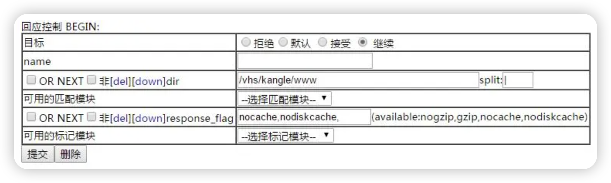

kangle禁止缓存/vhs/kangle/www目录的域名未绑定界面，防止新域名添加后不生效，回应控制dir模块





回应控制dir匹配模块，填写

```
/vhs/kangle/www
```

标记模块response_flag，填写

```
nocache,nodiskcache,
```

就对整个目录禁止缓存了，或者用file匹配模块，填写具体文件也可以
```
/vhs/kangle/www/index.html
```