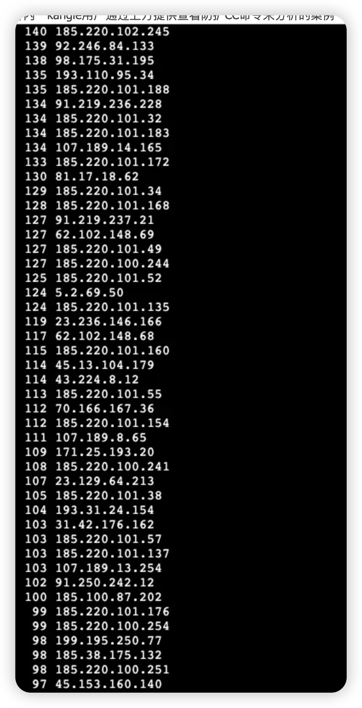

Linux kangle 通过 log日志标识分析来检查 black_list 模块加入的黑名单封禁ip列表，查看当前防CC攻击用户列表触发检测的IP并且排序

触发添加黑名单访问日志标识显示如下，，关键值：`( 0 0 )`


```
119.28.1.1 - - [06/Jan/2022:19:27:53 +0800] "GET https://www.itzmx.com/111 HTTP/1.1" 0 0 "-" "Mozilla/5.0 (Windows NT 10.0; Win64; x64) AppleWebKit/537.36 (KHTML, like Gecko) Chrome/96.0.4664.110 Safari/537.36"[L]
```

那么实时查看黑名单命令就是
```
tail -f /vhs/kangle/var/access.log | grep " 0 0 "
```


查看历史黑名单就是，根据ip排序
```
cat /vhs/kangle/var/access.log | grep " 0 0 " | awk '{print $1}' | egrep -o "[0-9]{1,3}\.[0-9]{1,3}\.[0-9]{1,3}\.[0-9]{1,3}" | sort | uniq -c | sort -nr
```


查看当前防CC攻击用户列表触发检测的IP并且排序
```
cat /vhs/kangle/var/server.log | grep "attack" | awk '{print $8}' | egrep -o "[0-9]{1,3}\.[0-9]{1,3}\.[0-9]{1,3}\.[0-9]{1,3}" | sort | uniq -c | sort -nr
```

注：触发防护CC模块检测不代表被拉黑，如果要查看黑名单请用查看黑名单命令，正常每ip该值应当始终为1，如果大于1甚至高的离谱代表代表对方在持续性发包攻击服务器


其它例子可以自行改写命令，例如查看用户ua字符串等等

我是中了kangle的毒了 一但用上了就离不开了。。没有kangle的服务器我一分钟也待不了
nginx，烂，慢，卡

还想到昨天的新闻吗，某服务器被某人用爬虫每秒100次请求就给爬死了然后被判了2年，所以等于说高于100就属于超大并发了
某超级计算数据中心被爬死了： https://www.163.com/dy/article/GSR5NE2505521T23.html
所以说，别指望nginx有多强，只能应付小型站点访问


群内一kangle用户通过上方提供查看防护CC命令来分析的案例




可以很明显的看到，大于 1 就是有问题，185.220.101.154 随便找个ip查下

```
ip: "185.220.101.154"
hostname: "tor-exit-154.relayon.org"
city: "Berlin"
region: "Berlin"
country: "DE"
loc: "52.5213,13.4096"
org: "AS208294 CIA TRIAD SECURITY LLC"
postal: "10178"
timezone: "Europe/Berlin"
asn: Object
asn: "AS208294"
name: "CIA TRIAD SECURITY LLC"
domain: "relayon.org"
route: "185.220.101.0/24"
type: "business"
company: Object
name: "CIA TRIAD SECURITY LLC"
domain: "relayon.org"
type: "business"
privacy: Object
vpn: false
proxy: false
tor: true
relay: false
hosting: false
service: ""
abuse: Object
address: ""
country: "US"
email: "abuse@relayon.org"
name: "CIA TRIAD SECURITY LLC"
network: "185.220.101.96-185.220.101.255"
phone: ""
domains: Object
total: 0
domains: Array
```


德国的tor代理ip，是肉鸡
然后他问怎么批量加入黑名单
黑名单 机房给你硬防接口了吗？有接口写个sh提交给硬防就好了，看ip基本一个段的 机房没给接口你可以手动让他们拉黑下，直接提交给机房185.220.100.1-185.220.102.255，这整个段都是肉鸡


小樱小樱，按照你那个attack大于1 拉黑，会把itdog那些拉黑掉，怎么解决呢
这种在线检测网站属于非人类的正常访问，没有误封拉黑是正确的，或者说适当调整你的预值，比如说sh脚本内设置为触发100次防cc检测才拉黑
